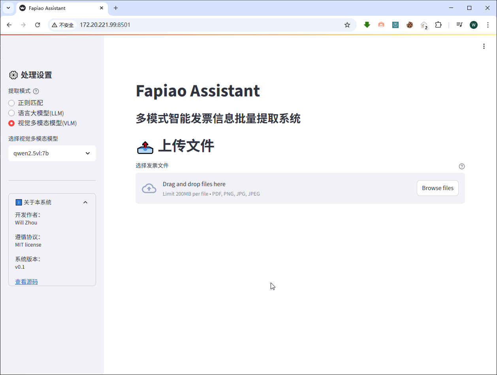
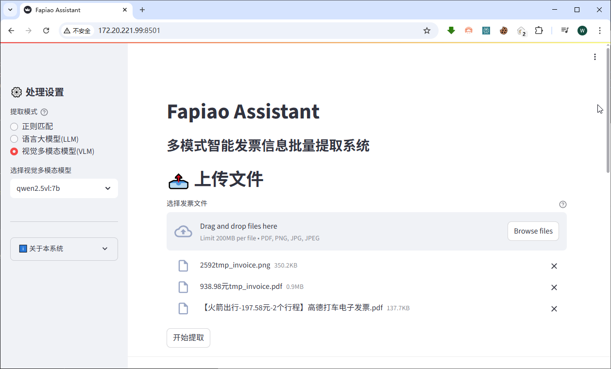
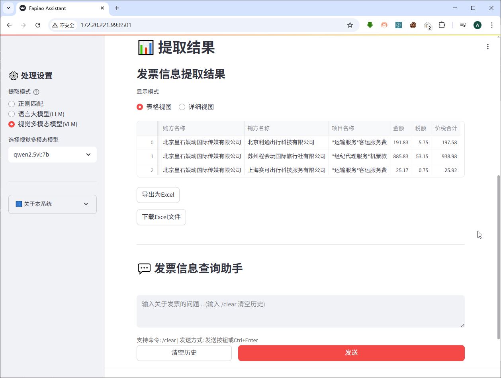
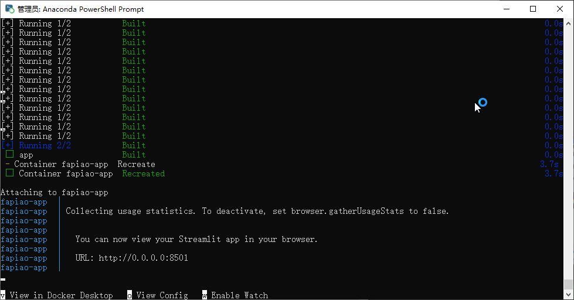

# FapiaoAssistant - 多模式智能发票信息批量提取系统


[](https://github.com/willzhou/FapiaoAssistant)

基于多模态大模型的智能发票信息提取工具，支持PDF/图片格式，提供三种提取模式，可自动识别发票关键字段，并生成Excel电子表格。
软件可用于公司或剧组等人员整理发票报销，也可以跟其他专门软件集成，用于处理相关工作。软件集成了大语言模型对话功能，可直接对话，分析统计发票数据。

## 软件截图

 
 
 
 

## 功能特性

### 多模式提取引擎
- **🔍 正则匹配**：快速提取结构化发票
- **🤖 LLM文本解析**：处理复杂PDF电子发票
- **🖼️ VLM多模态模型**：识别扫描件/拍照发票（优先使用qwen2.5vl:7b模型）

### 全面字段提取
```json
{
  "发票号码": "25327000000693796666",
  "开票日期": "2025-06-23",
  "购方名称": "北京XXXX国际传媒有限公司",
  "销方名称": "苏州市吉利优行电子科技有限公司",
  "金额": 98.77,
  "税额": 2.96,
  "价税合计": 101.73,
  "项目名称": "*运输服务*客运服务费"
}
```

### 文件格式支持
- 📄 PDF（电子发票）
- 🖼️ PNG/JPG（扫描件或手机拍摄）

## 🚀 快速开始

### 前置要求
- Python 3.8+
- [Ollama](https://ollama.ai/) 服务（用于本地模型运行）

### 安装步骤
```bash
# 克隆仓库
git clone https://github.com/willzhou/FapiaoAssistant.git
cd FapiaoAssistant

# 创建虚拟环境（推荐）
python -m venv venv
source venv/bin/activate  # Linux/Mac
venv\Scripts\activate     # Windows

# 安装依赖
pip install -r requirements.txt

# 下载qwen2.5vl:7b模型
ollama pull qwen2.5vl:7b
```

### 启动应用
```bash
# 启动Ollama服务（新终端窗口）
ollama serve

# 启动Streamlit应用
streamlit run app.py
```
应用默认访问地址：`http://localhost:8501`

## ⚙️ 配置说明

项目采用YAML格式配置文件（`config/settings.yaml`），主要配置项：

```yaml
# API配置
api_config:
  api_key: "EMPTY"  # 商业API密钥
  base_url: "http://localhost:11434"  # Ollama服务地址

# 模型配置（支持OLLAMA和VLLM）
ollama_model_options:
  "qwen2.5vl:7b":
    model_path: "qwen2.5vl:7b"
    type: "visual"

# 企业后缀词库
company_suffixes:
  - "公司"
  - "集团"
  - "科技"
```

## 📂 项目结构
```
.
├── app.py                # 主应用入口
├── config/               # 配置文件目录
│   ├── __init__.py       # 配置加载器
│   └── settings.yaml     # YAML配置文件
├── requirements.txt      # 依赖列表
├── extractors/           # 提取器实现
│   ├── base_extractor.py # 基础抽象类
│   ├── llm_extractor.py  # 大语言模型处理器
│   ├── regex_extractor.py# 正则表达式处理器
│   └── vlm_extractor.py  # 视觉语言模型处理器
├── models                # 数据模型定义
│   └── invoice.py        # 可快速改写为ORM
└── utils/                # 工具模块
    ├── file_utils.py     # 文件处理
    └── display_utils.py  # 界面显示
    └── llm_utils.py      # 语言模型工具
```

## 💡 使用技巧

1. **模式选择建议**：
   - 电子发票：LLM文本解析（推荐qwen3:1.7B）
   - 扫描件/拍照：VLM多模态模型（推荐qwen2.5vl:7b）

2. **配置引擎切换**：
   ```python
   from config import switch_to_vllm, switch_to_ollama
   switch_to_vllm()  # 切换到VLLM模型
   ```

3. **数据查询**：
   ```bash
   /查询 金额大于100的发票
   /统计 按销方名称分组
   /clear 清除历史记录
   ```

## 🛠️ 常见问题

❓ **模型下载缓慢**
```bash
# 中国大陆用户建议配置镜像源
export OLLAMA_HOST=mirror.ghproxy.com
ollama pull qwen2.5vl:7b
```

❓ **配置修改不生效**
- 修改settings.yaml后需要重启应用
- 检查YAML文件缩进格式（必须使用空格）

❓ **识别精度优化**
- 在settings.yaml中调整企业后缀词库
- 增加行业特定关键词（如"科技"、"医院"）

## 🤝 参与贡献
欢迎通过PR贡献代码：
1. Fork本仓库
2. 创建特性分支（`git checkout -b feature/xxx`）
3. 提交更改（`git commit -am 'Add some feature'`）
4. 推送到分支（`git push origin feature/xxx`）
5. 新建Pull Request

## 📜 开源协议
[MIT License](LICENSE) © 2024 Will Zhou

---

**生产部署建议**：
1. 使用Docker容器化运行
2. 将敏感配置移至环境变量
3. 定期更新企业后缀词库（config/settings.yaml）